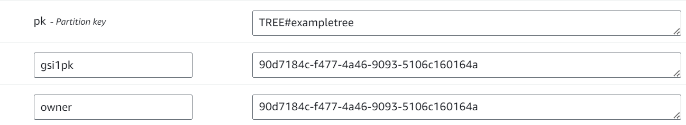

:warning: To see a live version of this project, click [here](https://linktree.portfolio.mannyserrano.com/katyperry).

# tl;dr
I built a Linktree clone. You can find it at the link above. The data model is robust, the architecture supports thousands of TPS, and the whole thing is secured with advanced IAM permission contexts and Cognito.

# Introduction
This project represents a copy of the core functionality of [Linktree](https://linktr.ee). Linktree is an online service whose core functionality allows individuals to host a single web page that hosts a collection of links related to them. For example, online influencers generally have a Linktree link in their social media bio sections. Upon clicking such a link, users are presented with a page of other links relevant to the influencer (generally things like their Instagram, Facebook, Amazon storefront, or their personal website). The following picture shows an example of popular singer Katy Perry's [Linktree page](https://linktr.ee/katyperry) (truncated). Clicking on any one of these list items would direct the user to the corresponding link. 
 

# Implementation
## Architecture
My Linktree clone has been implemented in somewhat of a 3-tier serverless SaaS architecture with a static webapp (React), API layer (API Gateway and Lambda), and a persistence layer (DynamoDB). It also uses a Cognito user pool, which is shared by all SaaS-like items in my portfolio, for signup and signin functionality. It was, like most projects in this portfolio, designed not to cost me tons of money at idle. However, it's also designed such that it could scale to a substantial number of concurrent users without failling over. CloudFront is used to cache the React webapp for lower latency reads and to cache common Trees to avoid hot DynamoDB partitions (and lower latency, of course). 

## Data Model
The data model needed to be resilient enough to conform to somewhat strict security requirements, but also performant enough to allow for very fast retrieval of data via common access patterns. Far and away, the most common access pattern of this application would be to retrieve a set of links for a given tree. Also, the data needed to be constructed in such a way that common trees (like those for social media celebrities) could be cached at CloudFront. The data model I chose, while basic, supports all of this.  

The following retrieval patterns are the ones I identified for this app
* Retrieve all Links that belong to a specific tree
* Retrieve all Trees that belong to a specific user
* Retrieve a user by their ID for things like user icon

An example data item for a Tree object is shown below. This snapshot is taken directly from the DynamoDB console. Note the `TREE#` prefix in the `pk` attribute. If you come from a SQL background or are unfamiliar with DynamoDB data modeling for relational data, then this may look foreign. If that's the case, I highly encourage a watch of [this](https://www.youtube.com/watch?v=yNOVamgIXGQ) talk by Alex Debrie or [this](https://www.youtube.com/watch?v=xfxBhvGpoa0) more advanced talk on the same subject from Rick Houlihan.

An example data item for a Link object is shown below. Note the `LINK#` prefix in the `pk` attribute as opposed to the `TREE#` prefix seen on the Tree object.
  

The gsipk attribute supports an overloaded global secondary index, which enables the "Get all links in a tree" and "Get all trees owned by person X" access patterns. This could just have easily been accomplished with a different key and index composition, but this was what I went with :smiley:

## Design Decision Log
__React will be used for the UI__  
1. React is the only frontend framework I can tolerate developing with, and it lets me sharpen my TypeSript skills
1. React is statically built, allowing it to be served by S3 and CloudFront without paying for a server
1. AWS Amplify has some React components that I can use for handling the signup/signin flow with Cognito _without_ redirecting users to the very ugly Cognito hosted UI

__DynamoDB will be used for data persistence__  
1. DynamoDB is cool
1. DynamoDB can be configured such that it has no RCU/WCU cost at idle with on-demand capacity provisioning. Aurora serverless can only do this in v1, and I don't like managing SQL connection cursors anyway.
1. I'm ultra-familiar with data modeling on DynamoDB from some other projects
1. The data I'm storing, while relational, does not require any complex joins or business logic on the database
1. The data I'm storing lends itself well to a key-value model, which DynamoDB can deliver at lightning speed
1. Storage and R/W capacity is _cheap_

__CloudFront will be used for caching__
1. CloudFront is pretty much the go-to caching on AWS for a global audience
1. Can cache both S3 and API GW under one roof
1. Provisioning certs and using them for CloudFront is very easy

__The OAuth `sub` value will be used as a user identifier__
1. It's readily available at signup when the user first creates an account
1. It's unique
1. It's sufficiently long and random that it will avoid weird indexing issues in DynamoDB's engine
1. The `sub` value is not considered a secret and can be freely exchanged
1. It's provided to Lambda by APIGW on each request, making permissions scoping easy and fast