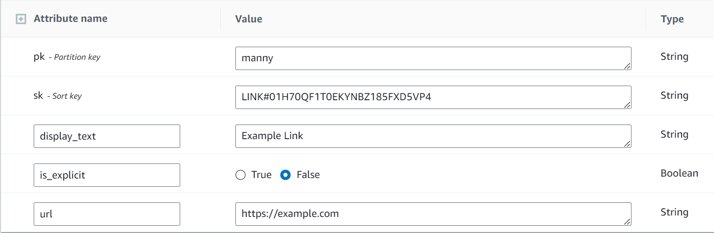

:warning: To see a live version of this project, click [here](https://linktree.portfolio.mannyserrano.com/katyperry).

# tl;dr
I built a Linktree clone with React, API Gateway, Lambda, and DynamoDB all deployed by CDK. You can interact with a live version at the link above. The data model is robust, the architecture supports thousands of TPS, and the whole thing is secured by Cognito.

# Introduction
This project represents a copy of the core functionality of [Linktree](https://linktr.ee). Linktree is an online service whose core functionality allows individuals to host a single web page that hosts a collection of links related to them. For example, online influencers generally have a Linktree link in their social media bio sections. Upon clicking such a link, users are presented with a page of other links relevant to the influencer (generally things like their Instagram, Facebook, Amazon storefront, or their personal website). The following picture shows an example of popular singer Katy Perry's [Linktree page](https://linktr.ee/katyperry) (truncated). Clicking on any one of these list items would direct the user to the corresponding link. 
 

# Implementation
## Requirements
Specifically, there were a few things I wanted to achieve with this implementation. For the purposes of these requirements, "users" are anonymous (unauthenticated) consumers of the service who simply view trees, and "owners" are authenticated entities who own a tree and can modify various attributes of that tree.
1. Owners should be able to reserve a "tree name" (which is actually just their username, just like the real Linktree)
1. Owners should only be able to write to links that they own
1. Owners should be able to specify a header icon for their tree
1. Owners should be able to specify individual icons for each link
1. Users should be able to view any tree and its associated links
1. Upon clicking any given link, a user should be redirected to the URL of that link _in a new window_
1. Links marked as explicit should be indicated in some way to users and the icon should be masked or hidden
1. Links marked as explicit should present an additional popup when clicked with a warning
1. All clicks on any given link should be tracked for statistical purposes

## Architecture
My Linktree clone has been implemented in somewhat of a 3-tier serverless SaaS architecture with a static webapp for the UI (React), API layer (API Gateway and Lambda), and a persistence layer (DynamoDB). It also uses a Cognito user pool, which is shared by all SaaS-like items in my portfolio, for signup and signin functionality. It was, like most projects in this portfolio, designed not to cost me tons of money at idle. However, it's also designed such that it could scale to a substantial number of concurrent users without falling over. CloudFront is used to cache the React webapp for lower latency reads and to cache common Trees to avoid hot DynamoDB partitions (and lower latency, of course). 

## Data Model - UPDATE!!!!!!
The data model needed to be resilient enough to conform to somewhat strict security requirements, but also performant enough to allow for very fast retrieval of data via common access patterns. Far and away, the most common access pattern of this application would be to retrieve a set of links for a given user's tree. Also, the data needed to be constructed in such a way that common trees (like those for social media celebrities) could be cached at the edge. The data model I chose, while basic, supports all of this.  

An example Link item is shown below. Note the `LINK#` prefix in the `sk` attribute. If you come from a SQL background or are unfamiliar with DynamoDB data modeling for relational data, then this may look foreign. If that's the case, I highly encourage a watch of [this](https://www.youtube.com/watch?v=yNOVamgIXGQ) talk by Alex Debrie or [this](https://www.youtube.com/watch?v=xfxBhvGpoa0) more advanced talk on the same subject from Rick Houlihan. The identifier portion of the sort key is a ULID, which is very much like a UUID, except by the nature of its construction it is natively URL-safe and natively chronologically-sortable. I use ULID by default for all identifiers where I would normally use a UUID for these reasons.
  

An example Click item is shown below. Note that, like the Link item, it also has a prefix to denote that this is a Click object stored alongside the Link objects under the same primary key. Note that the clickTime attribute is in ISO-8601 format, which makes it portable and chronologically-sortable like the ULID, which is perfect for time series data like this. This simple object structure unlocks tons of potential statistical methods.
  

The gsi1pk attribute supports global secondary index named ClickIndex, which asociates all Click items with a Link item, and thus enables the "Get all clicks for a specific link access pattern. If other access patterns were needed, this index could easily be overloaded with more context. However, there are no other access patterns in this project to address. This simple item structure combined with the ClickIndex provides tons potential analysis like A/B testing, affiliate relationships, etc.

## Authorization
The service uses a clever authorization mechanism that I'm very fond of in order to control write access to DynamoDB items. A full description of this mechanism can be found [here](NEEDS LINK). Essentially, upon each PUT, POST, or DELETE call, the Lambda function that serves the call gathers the authentication information appended to the payload and assumes an IAM role with the appropriate IAM context. The assumed role is then limited to DynamoDB attributes whose key matches the user's username. In effect, a given user is only allowed to execute write actions against resources that they own. This is a lightweight mechanism to enforce a basic access policy like this one that scales to an infinite number of users at constant time. If I had to implement a more complex access policy, I'd probably go with a vending machine.

# Deployment
The project is a TypeScript CDK project defined entirely within the `src/` directory. I've implemented a semi-custom CDK construct to handle the build and deployment of the React application into the hosting bucket during a CDK deployment. You can find the source to the webapp in `src/linktree-webapp`. Please note again that I am not a frontend developer.

# Design Decision Log
All good projects have a decision log. Here is mine.  
__Only serverless components will be used__
1. Most serverless components on AWS have the ability to scale to 0, which is desirable for a project that is deployed 24x7 for the purposes of this portfolio
1. With a serverful architecture, I'd have to constantly maintain servers and deal with patching. That's too much work for a portfolio item

__React will be used for the UI__  
1. React is the only frontend framework I can tolerate long-term development with, and it lets me sharpen my TypeSript skills
1. React is statically built, allowing it to be served by S3 and CloudFront without paying for a server
1. AWS Amplify has some React components that I can use for handling the signup/signin flow with Cognito _without_ redirecting users to the very ugly Cognito hosted UI

__DynamoDB will be used for state persistence__  
1. DynamoDB is cool :callme:
1. DynamoDB can be configured such that it has no RCU/WCU cost at idle with on-demand capacity provisioning. Aurora serverless can only do this in v1, and I don't like managing SQL connection cursors anyway
1. I'm ultra-familiar with data modeling on DynamoDB from some other projects
1. The data I'm storing, while relational, does not require any complex joins or business logic on the database
1. The data I'm storing lends itself well to a key-value model, which DynamoDB can deliver at lightning speed
1. Storage and R/W capacity is _cheap_

__CloudFront will be used for caching__
1. CloudFront is pretty much the go-to caching on AWS for a global audience
1. Can cache both S3 and API GW under one roof
1. Provisioning certs and using them for CloudFront is very easy

__The OAuth `sub` value will be used as a user identifier__
1. It's readily available at signup when the user first creates an account
1. It's unique
1. It's sufficiently long and random that it will avoid weird indexing issues in DynamoDB's engine
1. The `sub` value is not considered a secret and can be freely exchanged
1. It's provided to Lambda by APIGW on each request, making permissions scoping easy and fast