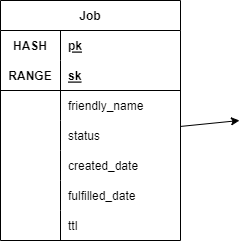
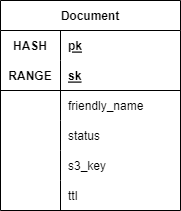

# tl;dr
I built a generic clone of [printme](https://printme.com/), a service that provides a friendly interface for you to print documents from anywhere. The webapp version of this service can be found [here](printme.portfolio.mannyserrano.com).

# Introduction
Recently my sister-in-law had a bridal shower hosted at my house. Part of the setup for that party was printing several pictures, guest cards, and game sheets. It was then that I encountered PrintMe, which at its core is a service that allows you to print documents from any PrintMe-enabled printer by simply emailing your document(s) to the PrintMe email address. PrintMe-enabled printers have a method to securely connect to the PrintMe servers and pull down your to-be-printed documents once your unique code is entered. This is fast, convenient, and mostly fool-proof. I wanted to make a clone of that core functionality on AWS for fun, and this directory represents the outcome of that exercise.

# Implementation
## Components
There are 3 main components of my PrintMe clone, with each component representing a piece of the workflow.

### Ingestion
The first piece of the puzzle is the mechanism to get documents uploaded and processed for printing, a process I've called ingestion for obvious reasons. The real PrintMe offers 3 main ways that it can ingest print jobs
1. By emailing your document to a specicic PrintMe email address
1. Uploading your document via a mobile app
1. Direct "File -> Print" drivers installed on a Mac or Windows OS

Given that I have neither the expertise nor the time to be writing OS drivers and building mobile applications by myself, I'll be implementing the following 2 methods
1. By emailing your document to a specific printme-clone email address
1. Uploading a document via a webapp

### Processing
The second step once files are uploaded is the processing, storage, and tracking of print jobs. Several operations need to be performed here. First, checks must be done against the uploaded file to ensure that the file is a printable type (i.e. PDF, JPG, DOCX, etc). Then the file needs to be stored appropriately and tracked, and a unique print job ID returned to the user for reference later when they visit a printme-enabled printer.

Of course, this process must be wholey secure and performant. Regardless of the ingestion method, the end result should be printable documents durably and securely stored and tracked Below are 2 sequence diagrams depicting the 2 implemented flows described above.

 
 

### Retrieval and Printing
The last step of the workflow is when the user visits a printme-enabled printer. This printer would prompt the user for their print job ID in the form of a barcode, retrieve the documents in the print job, and print them. Of course, this is where my implementation really deviates from the real PrintMe. I again have neither the expertise nor the time to build hardware appliances that interface with printers. Instead, I have mocked up this process via a basic app that can be run on a Windows machine, which achieves everything in this step except for the actual printing, which it simulates.

## Architecture
Now that we've gone over the components, we can start looking at the services used to achieve this implemenetation. The below diagram shows the services used in the solution and how they work together from the "user's perspective".

## Data Model
The data model for this project needed to be a bit more robust than some others. The structure needed to be solid enough to make my custom ORM classes manageable, but also flexible enough to support both ingestion flows and an inherently asynchronous workflow. I settled on 2 data entites (a Job and a Document) for the simplest implementation. Having 2 separate entities allows the Job state and the Documents within the job to change independently without tons of unnecessary writes while retaining their relationship to each other. This also means I can implement my [saas-authorization](../saas-authorization) mechanism, even if it is a little overkill. 

### Job
This is the data model for the Job entity. 
 

And here is an example of a Job entity stored in DynamoDB

#### Attributes
* pk - The hash key for the entire job. This hash key will be shared by the Job and all associated Documents as a way to optimize DDB engine storage and enable saas-authorization.
* sk - The range key for a Job. In the case of a Job, the range key will be identical to the hash key.
* friendlyName - The optional friendly name given to this print job by the user.
* status - The print job's status. Valid values are PENDING, FAILED, and FULFILLED.
* createdDate - The datetime string in ISO-8601 format denoting when the Job was first created.
* fulfilledDate - The datetime string in ISO-8601 format denoting when the Job was fulfilled via (simulated) printing.
* ttl - Time-to-live attribute denoting when the Job will be destroyed by the DDB engine. Essentially this acts as an expiration date for the Job and keeps storage costs down and partitions lean. If a comprehensive audit log was needed for this app (which it's not), this could be omitted. This is stored as a Unix timestamp and is always set 7 days from the creationDate.

### Document
This is the data model for the Document entity. 

And here is an example of a Document entity stored in DynamoDB

#### Attributes
* pk - The hash key for the entire Job. This hash key will be shared by the Job and all associated Documents as a way to optimize DDB engine storage and enable saas-authorization.
* sk - The range key for a Document. In the case of a Document, the range key will be the unique identifier for this Document within its Job.
* friendlyName - The friendly name for this document. Often, the file name from the source location.
* ttl - Time-to-live attribute denoting when the Document will be destroyed by the DDB engine. Essentially this acts as an expiration date for the Document and keeps storage costs down and partitions lean. If a comprehensive audit log was needed for this app (which it's not), this could be omitted. This is stored as a Unix timestamp and is always set 7 days from the time it was uploaded.