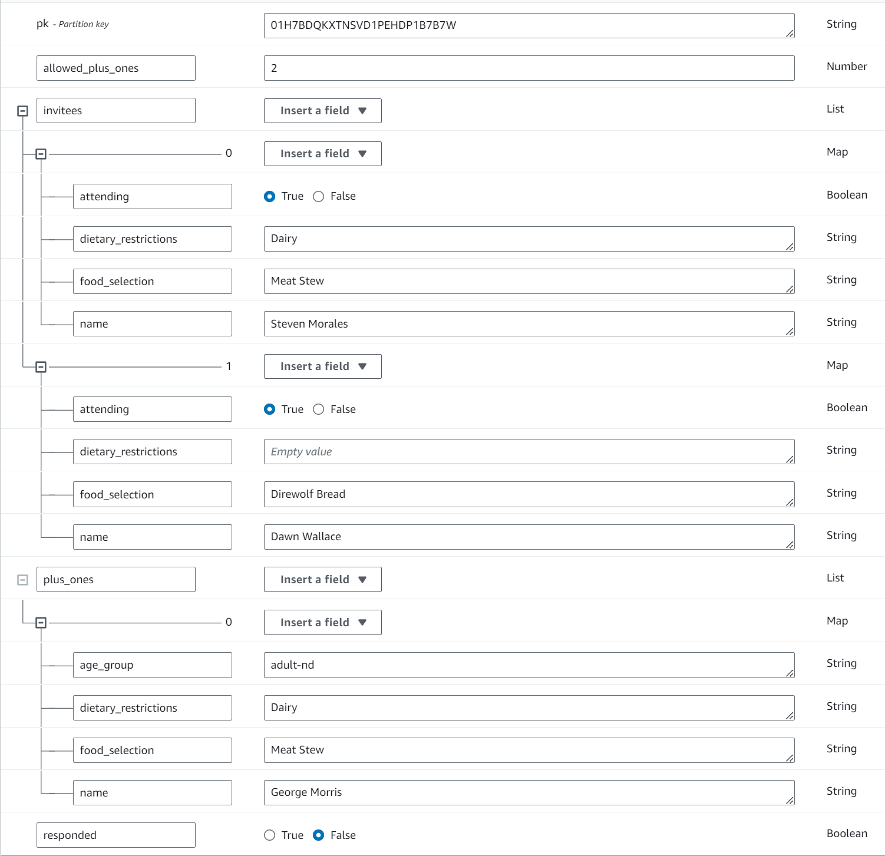

:warning: To see a live version of this project, click [here](https://rsvp.portfolio.mannyserrano.com/01H7BDQKXTNSVD1PEHDP1B7B7W) or [here](https://rsvp.portfolio.mannyserrano.com/01H7BDQJYFVF6SV69Q63AQKM4K) or [here](https://rsvp.portfolio.mannyserrano.com/01H7BDQJ5CXEG1DDGCBNPND438). Note that this webapp is meant to be access exclusively through mobile devices. 

Or scan this with your mobile device's camera app! 

# tl;dr
I built a webapp and backend that allows invitees to an event (in this case a wedding) to RSVP by scanning a personalized QR code attached to a physical invite or email. It uses React, API Gateway, Lambda, and DynamoDB all deployed by CDK. You can interact with a few examples at the links above. 

# Introduction
This project is an example of a basic RSVP website. However, as opposed to most RSVP solutions, the webapp is personalized for each person. Each invitee gets a unique URL that they can visit to RSVP. That URL can be disseminated to each invitee in whatever way the organizer chooses. I used this actual solution for my own wedding. We had generic invites printed with about 2 inches of blank space right in the center. Once we received the invites, we printed a QR code that mapped to each invitees URL for each invite on transparent stickers. Once each invitee received their invite, they scanned their QR code, answered the questions, and never had to text or call anyone throughout the process. Easy! We used stickers on physical invites, but this basic premise applies to any medium that can disseminate a URL directly or indirectly. The solution is also able to integrate very well with other existing event-based services like invite printing, invite mailing, etc. I didn't build any of that, because I didn't need it.

# Implementation
## Requirements
There were a few basic requirements I wanted to hit when I was originally building this for my own wedding, and here they are:
1. Each invitee's ability to add plus ones should be configurable _per invitee_
1. Each invitee's landing page should prominently display their name and the current state of their invitation (attending, plus one, food choice, etc)
1. Invitees should be able to specify dietary restrictions on the RSVP
1. Invitees should be able to choose from the available meal options
1. Invitees should be able to specify the age group of their plus ones (child, non-drinking age adult, drinking-age adult)
1. Children should _not_ be able to choose from the available meal options (Kid's meal only. Sorry kids)
1. Invitees should be able to specify whether or not they are bringing a plus one (if applicable)
1. Aggregated and detailed reporting should be possible on the data, such as:
    1. Retrieve the number of invitees who have responded
    1. Retrieve aggregated number for invitees who have not responded, who responded as attending, and total number of responded including plus ones
    1. Retrieve the number of attending drinking-age invitees including plus ones
    1. Retrieve a CSV file detailing each invitee, their attending status, their requested meal, and dietary restrictions

## Architecture
My RSVP solution is a 3-tier serverless solution with a static webapp for the UI (React), API layer (API Gateway and Lambda), and a persistence layer (DynamoDB). There is no authentication needed for the invitees, and write authorization is handled exclusively by IAM. CloudFront is used to distribute the webapp, while an edge-optimized API Gateway endpoint is used to make the API available. There is no caching needed aside from the webapp as the data is unique to each person and should only be access once or twice throughout the life of an RSVP. 

## Data Model
The data model is probably the simplest part of this implementation due to the nature of the data to persist and the very lax security requirements. The data model has an individual entity type (the invite) with one item per invite. Each invite item has a list of invitees, a list of plusOnes, and allowedPlusOnes, which is the pre-configured number of plus ones allowed. Combining all entities into a single object makes the presentation logic on the webapp somewhat more complex (see [the Lambda layer](./src/lib/lambda/domain_layer/) for how the entities interact with each other), but allows for an overall simpler data model. I could just have easily split the data model into 3 entities (invite, invitee, and plus one), and handled them individually. I decided against that as none of the entities have any meaning unless combined with the others. All data manipulation happens in an "all-or-nothing" fashion as an RSVP only has _meaning_ when the entire context is considered. An example Invite item is shown below. 
  

Question: Why aren't there different entity types for each entity? i.e. one entity for an invitee, another entity for a plus one, etc? The answer is because the value of those entities have no value individually. If you think about the idea of an RSVP, you don't need to track entities along the way as the user adds them in the webapp. The value of the invitees and plus ones only exist once the user submits the RSVP in full. Storing them separately would simply add more round-trips to DynamoDB for each submission that is unnecesarry. None of the identified access patterns require the retrieval of one entity without the others, and the value of those entities only have value in context of each other. Therefore, there is no reason I've identified to split the entities into their own items. Rather, they all exist on the same item, and that's fine. Also, the code that handles the business logic for each of these entities can still be split by entity type and consolidated together into a larger Invite object while keeping the individual entity classes lean. See the [domain layer](./src/lib/lambda/domain_layer) to understand more about the classes and their relationships to each other.  

# Deployment
The project is a TypeScript CDK project defined entirely within the `src/` directory. I've implemented a semi-custom CDK construct to handle the build and deployment of the React application into the hosting bucket during a CDK deployment. You can find the source to the webapp in `src/rsvp-webapp` in addition to deployed versions at the links at the top of this README. Please note again that I am not a frontend developer.

# Design Decision Log
All good projects have a decision log. Here is mine.  
__Only serverless components will be used__
1. Most serverless components on AWS have the ability to scale to 0, which is desirable for a project that is deployed 24x7 for the purposes of this portfolio
1. With a serverful architecture, I'd have to constantly maintain servers and deal with patching. That's too much work for a portfolio item

__React will be used for the UI__  
1. React is the only frontend framework I can tolerate long-term development with, and it lets me sharpen my TypeSript skills
1. React is statically built, allowing it to be served by S3 and CloudFront without paying for a server

__DynamoDB will be used for state persistence__  
1. DynamoDB is cool :call_me_hand:
1. DynamoDB can be configured such that it has no RCU/WCU cost at idle with on-demand capacity provisioning. Aurora serverless can only do this in v1, and I don't like managing SQL connection cursors anyway
1. I'm ultra-familiar with data modeling on DynamoDB from some other projects
1. The data I'm storing is exceedingly basic and does not require any complex operations
1. The data I'm storing lends itself well to a key-value model, which DynamoDB can deliver at lightning speed
1. Storage and R/W capacity is _cheap_

__CloudFront will be used for caching__
1. CloudFront is pretty much the go-to caching on AWS for a global audience
1. Provisioning certs and using them for CloudFront is very easy

__API Gateway Edge-Optimized will be Used__
1. My invitees were geographically-dispersed. Edge-optimized makes much more sense for latency purposes and because caching helps very little in this system.