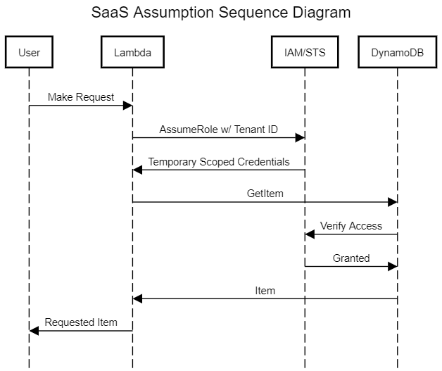

# tl;dr
This is a generic utility/PoC for obtaining tightly-scoped credentials in a SaaS setting that leverages the powers of IAM conditions and Cognito identities.

# Introduction
Building SaaS or SaaS-like offerings presents a bunch of challenges. Authentication and authorization are 2 very large examples of those challenges. With most independently-developed or independently-maintained SaaS offerings that I've been a part of (especially those with pooled data models), there's a need to ensure that users of your SaaS applications have access to their resources and only their resources. This can be accomplished tons of different ways, but one pattern I saw emerge quite often is as follows:
1. We are storing data in DynamoDB with a strong key structure. Each tenant's resources are scoped to their primary key, which is some unique identifier.
1. We are using Cognito for signup and signin functionality and identity management.
1. We need a secure mechanism to ensure that tenant A cannot accidentally or intentionally manipulate the resources of tenant B.

As I said, this general problem domain is common to all SaaS apps, but the above scenario is particularly relevant to early-stage startups. Most early-stage startups are trying to reduce operational overhead by using manged services, but want to ensure that their data stays safe. After all, a data breach is usually a death sentence to organizations just starting up.  

If you research this problem, you'll more than likely find a reference architecture for a token vending machine. That is, an independent system that is responsible for distributing or "vending" scoped credentials to various services on-demand. Generally, these TVMs use a combination of templated policy statements and IAM grants to achieve the security needed. These are incredibly nimble and powerful machines no doubt, but they are not easily understood or stood up for those who are unfamiliar with AWS or the cloud generally. Additionally, they are often overkill in terms of cost and complexity for small applications. If I need only provide authorization scoping to a particular user or tenant, implementing a vending machine _may be_ too much upfront work to make sense. However, trusting your business logic for each entity in your application to appropriately govern its resources is asking for trouble. This directory is a generalized example of solving that problem using basic IAM policy statements with conditions. Not only will this get most small SaaS applications by for quite some time, it is also extensible and provides the framework for upgrading to a TVM-based authorization mechanism with little modification should the need arise. While I am certainly far from the first to describe this behavior for this use, I use this idea so heavily that it warranted a spot in my portfolio.

# Mechanism
As noted before, this mechanism is based on IAM conditions and tenant identifiers. The basic gist is that your worker (Lambda function, EC2 instance, ECS task, etc) assumes a role and tags the session with an appropriate identifier. In this case, I use an identifier called TenantID. Through IAM magic, the worker that assumed that role automatically has its access scoped to a specific set of resources over a specific period of time. In this case, the permissions are scoped to a primary key in DynamoDB using the `LeadingKeys` IAM condition, but this same methodology can be used for just about any managed service you're interacting with based on that service's exposed conditions. For example, if you wanted to marshal email sending only from a particular address in SES, could use the `FromAddress` condition key in combination with a tenant ID or another attribute defined beforehand.

# Sequence Diagram
Instead of an architecture diagram, I've developed a simple sequence diagram to showcase the process. While this may not be _exactly_ how the services interact with IAM under the hood, this diagram accurately depicts the sequence described here. 

The Lambda function represents the middle layer (API) between the SaaS user and the persistence layer. When the user makes a request, it hits this Lambda function. This Lambda function then assumes the access role and injects the tenant's ID to scope the policy. The tenant's ID would typically be retrieved from the result of an authorization process (like Cognito or other JWT), however in the example the tenant ID is hardcoded for simplicity. Using this assumed role, the Lambda function makes requests to DynamoDB, which will now only be able to access data specific to that tenant ID, driven by the PK.

# Deploying for Yourself
This example project uses AWS Serverless Application Manager (SAM) to define and deploy the resources. Deployment using SAM requires the SAM CLI and Docker. The SAM CLI can be downloaded from AWS [here](https://docs.aws.amazon.com/serverless-application-model/latest/developerguide/install-sam-cli.html). Once the CLI is downloaded, you can clone this repository, navigate to the `saas-authorization\src` directory and run `sam build -u && sam deploy --guided`. The `--guided` flag will instruct SAM to walk you through the process of deploying. You can then populate the table with sample data using the `populate_table.py` script. This populates the database with items belonging to multiple tenants. Once deployed and populated, you need only run the Lambda function to see it work. You can do this from the Lambda console, the SAM CLI, the AWS CLI, or whatever mechanism tickles your fancy.  

The SAM project deploys a DDB table (the example pooled data source), a Lambda function (representing the service retrieving data on behalf of the SaaS user), a service role (the default role that Lambda is assigned), and an access role (the role that Lambda assumes at execution time).